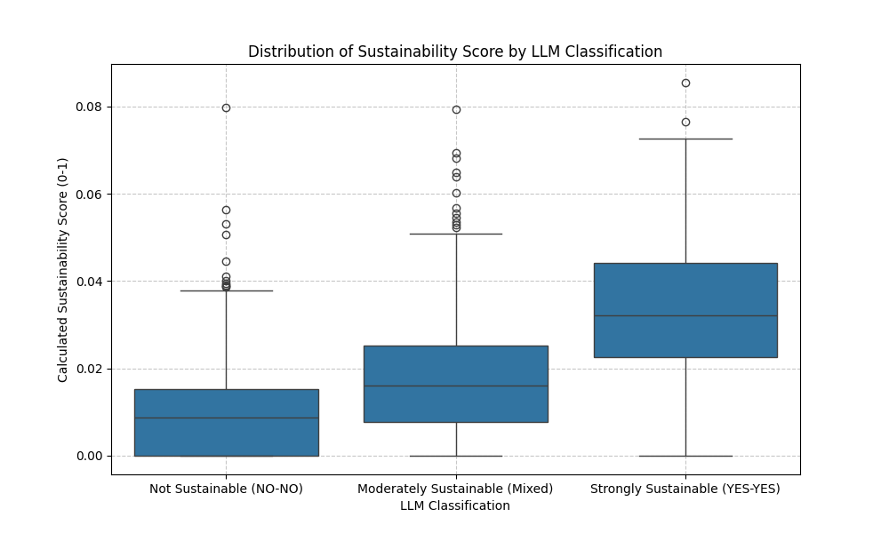
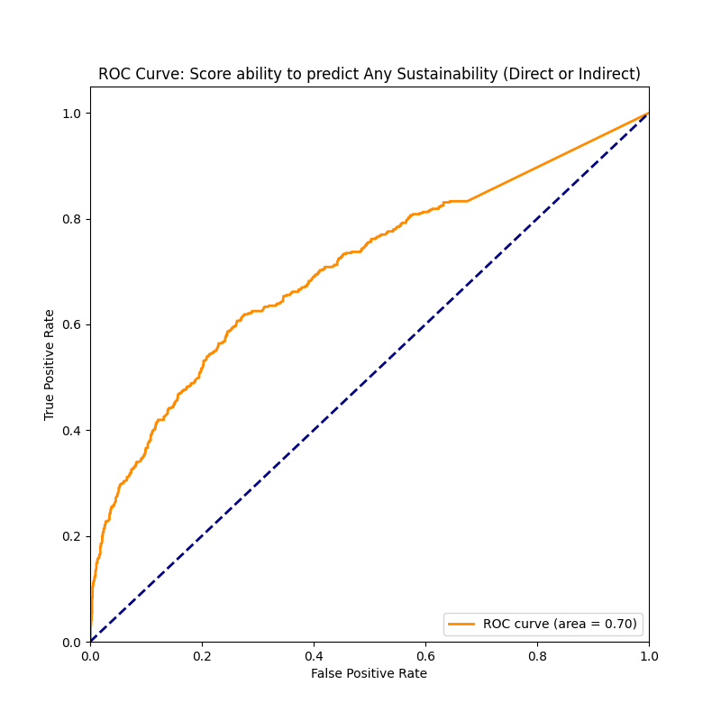
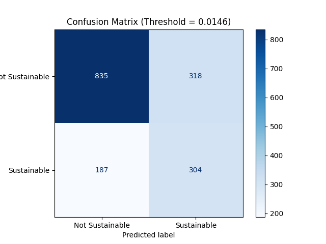

# Sustainability Validation Report

**Date:** 2026-01-24
**Scope:** Validation of Keyword-Based Sustainability Score vs. LLM Classification (Gemini 2.0 Flash).

## 1. Executive Summary

This report analyzes the effectiveness of our current keyword-based scoring system (`Sustainability_Score`) in identifying sustainable mobile applications. The "Ground Truth" for this validation is provided by an LLM (Google Gemini 2.0 Flash) which classified 1644 app descriptions as either:
- **Strongly Sustainable** (Directly & Indirectly Educational)
- **Moderately Sustainable** (Mixed attributes)
- **Not Sustainable** (Neither)

### Key Performance Metrics
| Metric | Value | Interpretation |
| :--- | :--- | :--- |
| **ROC AUC** | **0.705** | Fair predictive power. The score adds value over random guessing (0.5). |
| **Optimal Threshold** | **0.0146** | Scores above this value optimally balance precision/recall. |
| **Max F1-Score** | **0.546** | Moderate balance between precision and recall at the optimal threshold. |
| **Accuracy** | **69.3%** | Percentage of correct classifications at the optimal threshold. |

---

## 2. Visual Analysis

### A. Score Distribution (Boxplot)
**Goal:** Verify if "Sustainable" apps actually have higher scores.

*   **Observation:** There is a clear, statistically visible separation.
    *   **Strongly Sustainable** apps (green) have the highest median score (~0.034).
    *   **Not Sustainable** apps (blue) have the lowest (~0.01).
    *   *Conclusion:* The scoring logic fundamentally works, distinguishing the groups well on average.

### B. Predictive Power (ROC Curve)
**Goal:** Evaluate the trade-off between True Positives and False Positives.

*   **Observation:** The curve bows significantly above the diagonal line (random chance), confirming predictive capability.
*   **Target Area:** To improve, we want to push this curve further into the top-left corner.

### C. Classification Performance (Confusion Matrix)
**Goal:** detailed view of errors at the optimal threshold (0.0146).

*   **Precision (48.9%)**: When the system says "Sustainable", it is correct about half the time. This suggests we still have a "noisy" lexicon — unrelated apps are getting high scores (False Positives).
*   **Recall (61.9%)**: The system successfully catches ~62% of all truly sustainable apps. We are missing ~38% (False Negatives), likely due to descriptions not using our specific keywords.

---

## 3. Detailed Statistics

### Score Means by Category
- **Strongly Sustainable**: `0.0345`
- **Moderately Sustainable**: `0.0177`
- **Not Sustainable**: `0.0099`

### Direct vs. Indirect Education
- **Directly Educative Mean**: `0.0296`
- **Indirectly Educative Mean**: `0.0171`
*Insight:* Apps that *teach* sustainability explicitly (Direct) are much easier for our keyword system to catch than games that just feature eco-mechanics (Indirect).

## 4. Recommendations

1.  **Threshold Implementation:** Adopt a threshold of **0.015** for filtering "likely sustainable" apps in production.
2.  **Lexicon Refinement (Reduce False Positives):** Review high-scoring "Not Sustainable" apps. Common words like "environment", "green", or "nature" might be used in non-sustainability contexts (e.g., "game environments", "green gems").
3.  **Lexicon Expansion (Reduce False Negatives):** Analyze "Strongly Sustainable" apps that got low scores to find missing terminology.
