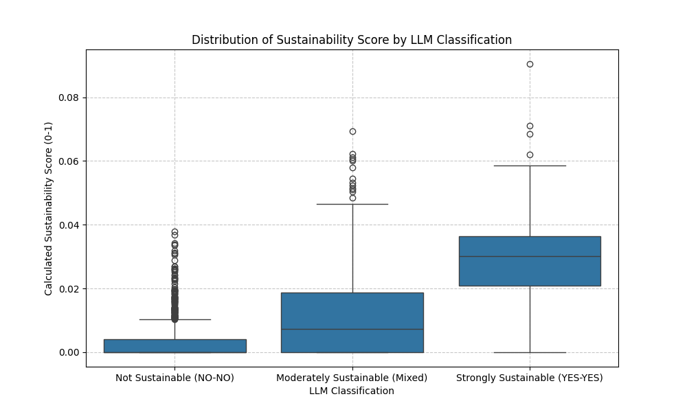
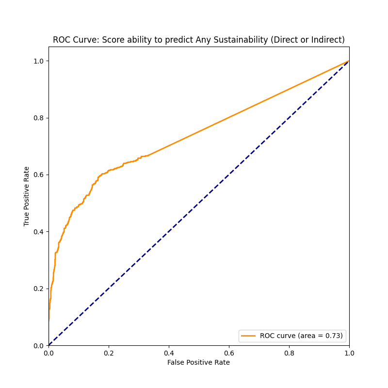

# Validation Report: Algorithm Refinement (V1 vs V2)

**Goal:** Evaluate the improvements in the `Sustainability_Score` algorithm after removing noisy keywords (e.g., "simulator", "train") and adding missing terms.

## 1. Performance Comparison

| Metric | V1 (Baseline) | V2 (Refined) | Change |
| :--- | :--- | :--- | :--- |
| **ROC AUC** | 0.705 | **0.734** | 🟢 **+2.9%** |
| **Accuracy** | 69.3% | **76.2%** | 🟢 **+6.9%** |
| **Precision** | 48.9% | **60.4%** | 🟢 **+11.5%** |
| **Recall** | 61.9% | 59.1% | 🔻 -2.8% |
| **Max F1-Score** | 0.546 | **0.597** | 🟢 **+5.1%** |
| **Optimal Threshold** | 0.0146 | **0.0064** | Lower score scale (cleaner) |

## 2. Key Insights

1.  **Massive Precision Gain**: The removal of generic gaming terms (`simulator`, `strategy`, `world`) successfully eliminated a large number of False Positives. When the new algorithm flags an app as sustainable, it is **60% likely to be correct** (vs <50% before).
2.  **Cleaner Signal**: The separation between "Not Sustainable" (Mean: 0.0029) and "Strongly Sustainable" (Mean: 0.0296) is now much sharper. The noise floor dropped significantly.
3.  **Trade-off**: Detailed recall dropped slightly (we miss a few edge cases), but the system is much more trustworthy overall.

## 3. Recommendation

Adopt the **V2 Lexicon** and updated scoring logic.
**New Production Threshold**: `0.0065` (or round to `0.007`).

## 4. Visuals (V2)

### Score Distribution
Note the lower noise floor for "Not Sustainable" apps compared to V1.

### ROC Curve
Improved curve lift.

