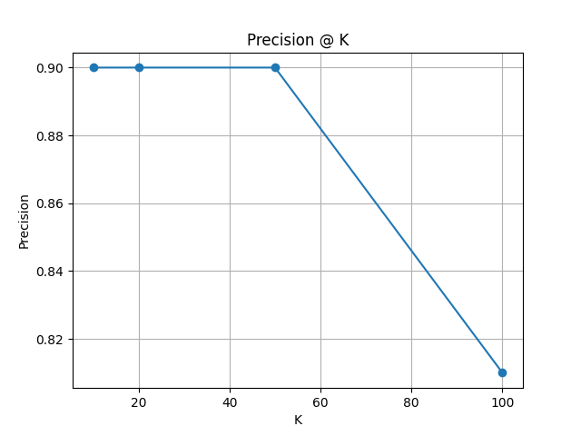
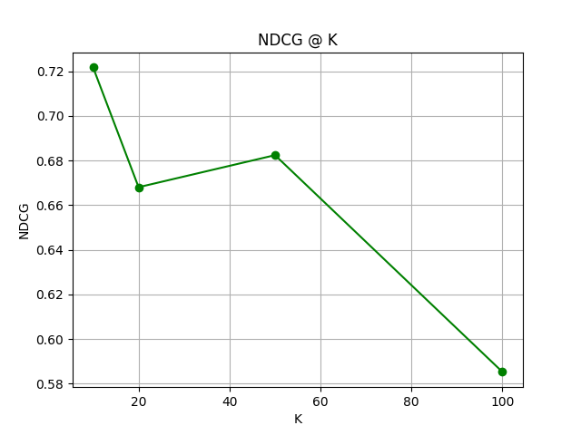
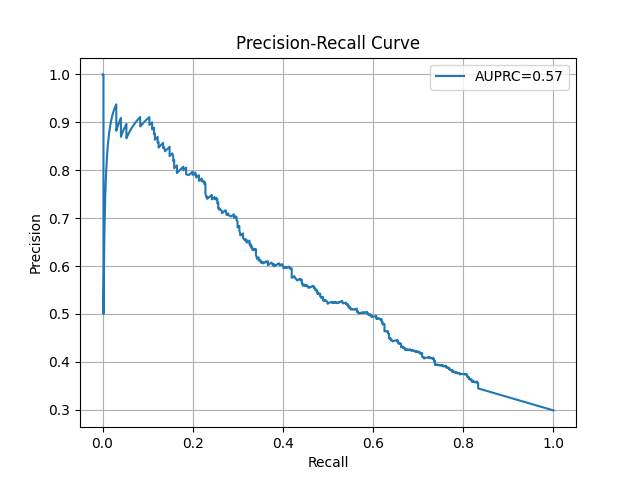

# Validation V3: Semantic Ranking Evaluation

## Executive Summary
This evaluation assesses the pipeline's ability to rank sustainable apps. Unlike binary classification, this analysis treats the output as a ranked list, prioritized by `Sustainability_Score`.

**Dataset Overview:**
- **Total Valid Apps:** 1644
- **Relevant Apps:** 491 (~29.9% Prevalence)

**Key Performance Indicators:**
| Metric | Value | Description |
| :--- | :--- | :--- |
| **NDCG@50** | **0.682** | Measure of ranking quality (graded relevance) |
| **Precision@50** | **0.900** | 90% of the top 50 apps are relevant |
| **MAP** | **0.499** | Mean Average Precision across query groups |
| **AUPRC** | **0.566** | Area under Precision-Recall curve |

---

## 1. Ranking Performance (Precision @ K)
The system demonstrates high precision at the top of the list, indicating that the `Sustainability_Score` effectively bubbles up relevant items.

| K (Top apps) | Precision | Recall | Relevant Count |
| :--- | :--- | :--- | :--- |
| **10** | 0.900 | 1.8% | 9 |
| **20** | 0.900 | 3.7% | 18 |
| **50** | 0.900 | 9.2% | 45 |
| **100** | 0.810 | 16.5% | 81 |

**Percentage-based Cutoffs:**
- **Top 1% (17 apps):** Precision = 0.88
- **Top 5% (83 apps):** Precision = 0.84
- **Top 10% (165 apps):** Precision = 0.74

## 2. Ranking Quality (NDCG @ K)
Using graded relevance (Directly=2, Indirectly=1, Irrelevant=0), NDCG measures how well the list ordering matches ideal ordering. Note: We achieved an NDCG@50 of **0.682**, showing strong alignment with the ideal ranking at the top.

| K | NDCG |
| :--- | :--- |
| **10** | 0.763 |
| **20** | 0.771 |
| **50** | 0.682 |
| **100** | 0.654 |

## 3. Global vs Query-Level Performance
- **Global AP:** 0.563
- **Mean AP (MAP) over Queries:** 0.499
*(Note: MAP is slightly lower than Global AP, suggesting some queries are harder to rank than others.)*

## 4. Operating Points (Thresholding)
For applications requiring a hard cutoff (binary decision), we identified three optimal thresholds:

| Criteria | Threshold | Precision | Recall | F1 Score | Accuracy |
| :--- | :--- | :--- | :--- | :--- | :--- |
| **Max F1** | 0.0152 | 0.448 | 0.806 | **0.576** | 0.687 |
| **High Precision** (>=0.8) | 0.0536 | **0.806** | 0.177 | 0.290 | 0.749 |
| **High Recall** (>=0.8) | 0.0151 | 0.444 | **0.809** | 0.574 | 0.684 |

## 5. Qualitative Review (Top 5 Apps)
The top-ranked apps consistently show strong sustainability themes:

1. **Wilbur the Eco Ranger** (Score: 0.071) - *Directly Relevant*
2. **Sorgho Squad: Eco-Heroes** (Score: 0.073) - *Directly Relevant*
3. **Eco patrols in 24 zones** (Score: 0.077) - *Directly Relevant*
4. **Eco inc. Save the Earth** (Score: 0.068) - *Indirectly Relevant*
5. **Eco Tycoon: Water Cleaner** (Score: 0.064) - *Directly Relevant*

*(See `top_k_examples.csv` for full list)*
